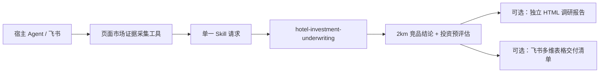

# 智竞未来电竞酒店投测 Skill

当前开发版本：`1.0.0`。这是一个用于签约前判断的单一生产 Skill，不是独立 App、审批系统或项目数据库。它包含一个无界面的、可替换引擎的页面市场证据采集工具。

它做三件彼此分离的事：

1. 以明确的页面采集引擎/Profile 获取可追溯的点位、竞品、公开房型、图片和同条件价格证据；
2. 分析确认点位 2km 内的纯电竞酒店竞品，输出可追溯竞品集和 ADR 参考；
3. 用确定性财务机械计算投资、收入、成本、NPV、IRR、按月静态/动态回本期、盈亏平衡 OCC、退出红线和谈判底线。

在上述结果完成后，Skill 可额外输出一份独立、响应式、单文件 HTML 竞品调研报告，或一份标准飞书多维表格交付清单；两者都只是结果交付层，不参与任何 2km、ADR 或财务判断。

## 唯一生产发布物

只发布 `hotel-investment-underwriting/`。宿主负责对话、来源账户/密钥、持久化和消息发送；Skill 的 `collect_market_evidence` 通过 Playwright、Ego Lite、Ui.Vision+OpenCLI、Kimi WebBridge、crawl4ai 或 xcrawl 采集页面证据，但不拥有 UI、登录凭证、数据库或状态系统。



## 核心规则

- 只接受确认的 GCJ-02 中心点和同坐标系候选点；Skill 自行计算 0–2,000 米 Haversine 距离。
- 页面证据采集器必须先完成全量 2km 候选，再对明确价格/视觉标杆采集房型、图片和报价；地图到 OTA 的候选池以中心、引擎/Profile、数量和 provider-place-ID 指纹严格绑定。回执标明所用引擎、Profile、每个页面来源 URL/HTTP 状态、采集时间和五项覆盖度。引擎不可用或页面结构变更时必须显式失败/待补，不能以模型臆测补齐。
- 正式竞品必须是营业中的主营电竞住宿，候选与中心点使用同一地图 `provider`，并有完整来源记录。
- 仅在采集完整、同一 `pricing_context`（入住日期、晚数、人数、CNY）下，同机位至少有三家独立的中/高置信度正式竞品时，才输出按 10 元取整的中位数 ADR 参考；低置信度来源仍展示，但不计入 ADR 样本。
- 竞品建议不会自动写入财务输入；由分析人员显式选择收入假设。
- 只有点位或全量 2km **空间**证据不完整时，Skill 输出和嵌套财务结果的 `conclusion_scope` 才为 `pre_evaluation_only`。OTA 的图片/价格回执可以是 `partial`，但已完成的空间竞品结论仍可审阅；对应机位 ADR 保持为空，交付清单保留待补项。
- 财务结果同时给出历史投资表口径的 `static_payback_months`（一次性初投 ÷ 首年平均月经营净现金）和折现持续回本的 `discounted_payback_months`；两者均附向上取整的整月值，不能互相替代。
- `scripts/collect_market_evidence.py` 是唯一页面采集入口，`scripts/run.py` 是唯一测算入口；`calculate.py` 仅供 Skill 内部调用。
- 部署到 Mac Mini/Hermes 后先执行 `collect_market_evidence.py --preflight --all-engines`。Ego Lite、Ui.Vision+OpenCLI 或 Kimi WebBridge 未安装、扩展未连接或适配器未配置时，工具给出可展示的安装动作，不会降级或虚构价格。

## 快速运行

先采集平台无关的页面证据。地图 Playwright、OTA Ego Lite Profile 与 Mac Mini/Hermes 安装流程见 [market-evidence-collection.md](hotel-investment-underwriting/references/market-evidence-collection.md) 和 [market-evidence-runtime.md](hotel-investment-underwriting/references/market-evidence-runtime.md)。

```bash
python3 hotel-investment-underwriting/scripts/collect_market_evidence.py \
  --input /path/to/collection-request.json \
  --format skill-patch > /path/to/market-evidence-patch.json
```

```bash
python3 hotel-investment-underwriting/scripts/run.py \
  --input /path/to/skill-request.json \
  --defaults hotel-investment-underwriting/references/benchmark-defaults.json \
  --format feishu
```

生成可离线查看的竞品调研报告：

```bash
python3 hotel-investment-underwriting/scripts/run.py \
  --input /path/to/skill-request.json \
  --defaults hotel-investment-underwriting/references/benchmark-defaults.json \
  --format html > /path/to/competitor-research.html
```

HTML 内嵌样式、表格、文本以及请求中提供的 JPEG/PNG/WebP `data_uri` 图片；正式竞品的房图、装修观察、机位和同条件报价会集中在“视觉竞品对标”区，供人工调价研判。文件可脱离 Skill 运行环境在手机或电脑浏览器中打开；来源链接仅用于在线追溯，视觉证据不会自动改写 ADR 或财务输入。

生成标准飞书多维表格交付清单：

```bash
python3 hotel-investment-underwriting/scripts/run.py \
  --input /path/to/skill-request.json \
  --defaults hotel-investment-underwriting/references/benchmark-defaults.json \
  --format bitable > /path/to/bitable-delivery.json
```

该 JSON 是一个无凭证的写入清单：授权的宿主将它映射到八张标准表（项目总表、输入、成本、年度现金流、情景敏感性、房型、2km 竞品、报价与视觉证据）。它没有飞书 API 调用、公式、远程图片抓取或项目状态；相同输入指纹可幂等更新，变更输入会形成新的项目运行。写入前必须读取 `delivery_gate`：资料不齐时三张专题表会写入可见“待补”记录，项目总表标记“待补证据”；资料齐全时也先标记“待写入核验”，只有宿主上传并读回附件后才能改为“可交付”。详情见 [bitable-delivery.md](hotel-investment-underwriting/references/bitable-delivery.md)。

请求契约见 [skill-request.schema.json](hotel-investment-underwriting/schemas/skill-request.schema.json)，财务字段见 [input-schema.md](hotel-investment-underwriting/references/input-schema.md)。

## 文档入口

- [架构边界](docs/ARCHITECTURE.md)：宿主、Skill 与人工职责，以及失败策略。
- [数据契约](docs/DATA_CONTRACTS.md)：请求、竞品事实、视觉证据、页面采集回执与输出字段。
- [部署与打包](docs/DEPLOYMENT.md)：生产运行、HTML、飞书多维表格交付与发布包清单。
- [运行说明](docs/OPERATIONS.md)：结果状态、补证动作与表格交付顺序。
- [测试与发布验收](docs/TESTING.md)：必测行为和上线门槛。
- [端到端验收](docs/END_TO_END_ACCEPTANCE.md)：不用 Codex Computer Use 的真实页面采集、测算与交付验证路径。
- [安全边界](docs/SECURITY.md)：凭证、来源、图片证据和飞书写入边界。
- [Git 与版本](docs/GIT_WORKFLOW.md)、[版本说明](docs/VERSIONING.md)：提交、tag 与 GitHub 发布流程。

仓库只保留运行、验证和维护这一生产 Skill 所需的文本源码。过期的区位包、施工守卫、任务/授权状态、审批/回放控制面、旧爬虫实现及历史客户原始文件均不在当前发布分支；需要追溯时使用 Git 历史。
