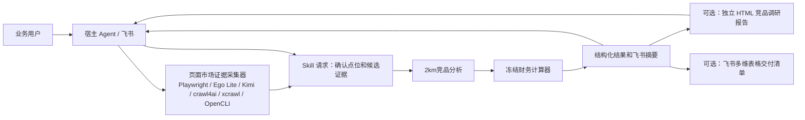

# 单一 Skill 架构

## 目标

将签约前电竞酒店判断收敛为一个可同步调用、无状态、可快速部署的 Skill。它不提供 Bot 服务、数据库、审批流或项目管理功能；页面市场证据采集是正式业务契约，但以无界面、可替换引擎的本地工具实现。

## 运行时边界

| 边界 | 责任 |
|---|---|
| 宿主 | 对话、来源会话/密钥、项目保存、消息发送，以及获授权后的飞书多维表格写入。 |
| 页面证据工具 | 以住宿发现词组建立全量 2km 候选及不可变 `spatial_collection`，再用显式标杆集的 OTA Profile（携带同一全量 `candidate_pool`）抓取房型、图片和同条件报价；返回当前宿主 HMAC、引擎、Profile、页面真实 HTTP 状态（或明确未观察）、采集时间和覆盖度回执。 |
| Skill | 校验回执证明、2km Haversine 距离、正式主营电竞筛选、ADR 汇总、财务计算、结论和缺失项。 |
| 人工 | 确认歧义点位、选择是否将竞品 ADR 写入收入假设、签约审批。 |

页面证据工具是普通的 CLI/localhost HTTP 业务接口：Hermes、OpenAI Agent 或其他
宿主调用它时，不需要 Codex Computer Use、桌面 UI 或由模型手工复制页面内容。Ego Lite
只是在 macOS 上提供一个有隔离 Space 的已授权浏览器运行时；Playwright 与其他适配器
同样必须通过 `market-evidence-collection/v2` 回执进入 Skill。

## 唯一业务链路

1. 宿主调用 `collect_market_evidence`：由地图 Profile 以住宿发现词组取得全量中心点和同源候选，再由 Ego Lite/Ui.Vision+OpenCLI 或其他显式 OTA Profile 取得标杆的房型、图片与同条件报价；两阶段以中心、Profile、候选 ID 与不可变事实快照绑定，HMAC 页面回执与覆盖度是输入的一部分。
2. `competitor_analysis.py` 在 Skill 内计算 2km 直线距离并筛出 `pure_esports_hotel`。
3. 空间候选池完成即可形成可审阅的 2km 正式竞品集合；全部证据维度完成、共享报价条件有效且同机位至少有 3 家独立的中/高置信度正式竞品时，才输出 ADR 中位数参考；低置信度竞品仍展示但不计入报价样本。
4. `input_contract.py` 先严格校验财务输入，`calculate.py` 再使用分析人员明确提供的财务输入完成回报测算。
5. `run.py` 一次返回竞品结论、财务结论、置信度和补证条件；选择 `--format html` 时，`competitor_report.py` 仅将这一结果和可选展示证据渲染为单文件交付物，其中视觉竞品对标区集中展示正式竞品的房图、装修观察和同条件报价。
6. 选择 `--format bitable` 时，`bitable_delivery.py` 将同一结果映射为八张标准表的无凭证清单。宿主按记录键写入、再解析关联并上传已给的图片字节；Base 不含公式或重新计算逻辑。

竞品 ADR 是决策证据，不会隐式写入 `revenue.egame_adr`。这样可以避免外部数据采集不完整时悄然改变财务结论。
HTML 报告也不反向影响任何竞品或财务输入；视觉区只支持人工调价研判，它不发起网络请求、不保存状态，图片以受限的 `data_uri` 内嵌。
飞书交付也不反向影响任何输入；它不保存凭证、不访问远程图片、不承担项目状态或审批职责。

## 运行时不包含的内容

- 历史商圈评分、候选补丁和独立受控运行；
- 项目修订、审批、归档和回放服务；
- 施工守卫、任务状态、开发授权文件；
- 需要持久任务、数据库或人工审批的通用爬虫平台。

这些旧实现已从仓库删除。若宿主另行拥有相应能力，也不能把它们变成一次投测的运行时前置条件。

## 失败策略

- 未确认点位：返回 `needs_location_confirmation`，不生成竞品结论。
- 页面来源不可用、结构/Profile 校验失败、采集不完整、候选来源缺失或候选地图 ID 重复：返回 `evidence_insufficient`，仍可输出带 `pre_evaluation_only` 标记的财务预评估。
- 地图 provider 不一致：返回 `evidence_insufficient`，不混合不同地图的实体 ID。
- 样本不足、报价条件缺失或只有低置信度报价：保留竞品清单，不输出建议 ADR。
- 财务输入非法：快速失败，不由模型补算。
